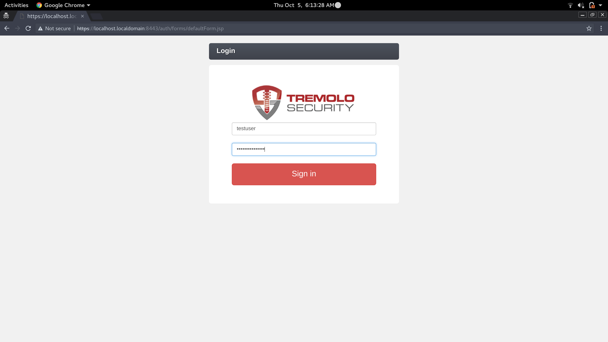
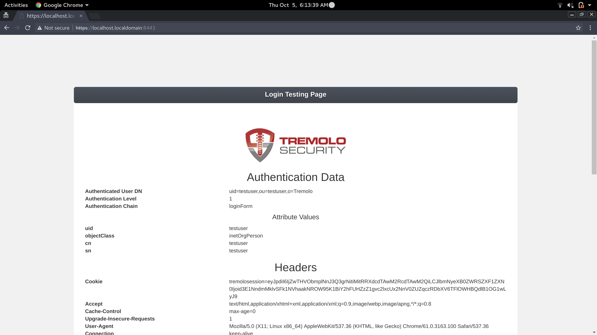

# OpenUnisonS2IDocker

This image is the base "builder" image for OpenUnison.

## What is OpenUnison?

OpenUnison is an open source identity management solution from Tremolo Security (https://www.tremolosecurity.com/) that provides:

* Web Access Management (WAM)
* SSO (Single Sign-On/Simplified Sign-On)
* Workflow based user provisioning
* User self service portal
* Reporting
* Identity Provider

Documentation is available at https://www.tremolosecurity.com/documentation/

## Deployment Options

Since this image is assumed to work with S2I there are three inputs that can be given to the s2i script:

1. A directory containing the OpenUnison war file
2. A directory containing a maven project to build an OpenUnison deployment
3. A git URL to a repository containing a maven project to build an OpenUnison deployment

Some assumptions are made about the deployment, each of which is covered in detail in the next section:

1. OpenUnison is built with the `openunison-on-undertow` dependency
1. The OpenUnison keystore is stored OUTSIDE of the final image in a volume (or secret for Kubernetes or OpenShift)
2. Passwords, host names and other environment specific information is stored in a properties file

## Configuring OpenUnison

### The Build Process

OpenUnison Deploying OpenUnison on Undertow uses the below workflow:


Maven is used with the overlay plugin to combine your specific configurations with the standard OpenUnison build to create a war file that includes:

1. OpenUnison's baseline dependencies
2. Undertow
3. Your configuration and libraries

The resulting war file from your build is then integrated into the final container image.

### Quick Starts

There are a number of quick starts available in the Tremolo Security github repositories - https://github.com/TremoloSecurity?utf8=%E2%9C%93&q=openunison-qs&type=&language=.  Each one has its own set of configuration variables and pre-requisites.  The rest of this tutorial assumes using the openunison-qs-simple project.  

### Setup Your Project

First, fork the quick start you are planning to work off of then clone it locally:

```bash
$ git clone https://github.com/myusername/openunison-qs-simple.git
$ mkdir local
```

### Create the OpenUnison Configuration

The next step is to go into `local` to create the keystore and paramters file:

**Create Keystore TLS key**
```bash
$ keytool -genkeypair -storetype PKCS12 -alias unison-tls -keyalg RSA -keysize 2048 -sigalg SHA256withRSA -keystore ./unisonKeyStore.p12 -validity 3650
Enter keystore password:
Re-enter new password:
What is your first and last name?
  [Unknown]:  localhost.localdomain
What is the name of your organizational unit?
  [Unknown]:  demo
What is the name of your organization?
  [Unknown]:  demo
What is the name of your City or Locality?
  [Unknown]:  demo
What is the name of your State or Province?
  [Unknown]:  demo
What is the two-letter country code for this unit?
  [Unknown]:  demo
Is CN=localhost.localdomain, OU=demo, O=demo, L=demo, ST=demo, C=demo correct?
  [no]:  yes

Enter key password for <unison-tls>
	(RETURN if same as keystore password):
```

NOTE: Make sure that your keystore password and key password are the same.

Next, create a sessoin key

**Create OpenUnison Session Key**
```bash
$ keytool -genseckey -alias session-unison -keyalg AES -keysize 256 -storetype PKCS12 -keystore ./unisonKeyStore.p12
```

NOTE: Make sure that your keystore password and key password are the same.

Once the keystore is created, create a file called `ou.env` with the bellow content:

**ou.env File**
```properties
OU_HOST=localhost.localdomain
TEST_USER_NAME=testuser
TEST_USER_PASSWORD=secret_password
unisonKeystorePassword=start123
unisonKeystorePath=/etc/openunison/unisonKeyStore.p12
```

NOTE: make sure you specify the passwords you used earlier to create the keystore.

Next create the `openunison.yaml` file:

**openunison.yaml**
```yaml
---
open_port: 8080
open_external_port: 80
secure_port: 8443
secure_external_port: 443
secure_key_alias: "unison-tls"
force_to_secure: true
activemq_dir: "/tmp/amq"
quartz_dir: "/tmp/quartz"
client_auth: none
allowed_client_names: []
ciphers:
- TLS_RSA_WITH_RC4_128_SHA
- TLS_RSA_WITH_AES_128_CBC_SHA
- TLS_RSA_WITH_AES_256_CBC_SHA
- TLS_RSA_WITH_3DES_EDE_CBC_SHA
- TLS_RSA_WITH_AES_128_CBC_SHA256
- TLS_RSA_WITH_AES_256_CBC_SHA256
path_to_deployment: "/usr/local/openunison/work"
path_to_env_file: "/etc/openunison/ou.env"
```

NOTE: It's very important to not change the paths.  Configuration changes in this file should focus on the TLS configuration (ie chenging the ciphers, adding client authentication, etc).


## Deploy OpenUnison with s2i

Before building your container, download the S2I binary for your platform and add it to your path - https://github.com/openshift/source-to-image/releases

```bash
$ s2i  build /path/to/my/root/myproject tremolosecurity/openunisons2idocker  local/openunison
```

This will create an image in your local Docker service called local/openunison with your OpenUnison configuration.  Finally, launch the image.

```bash
$ docker run -ti -p 8443:8443 -v /path/to/local:/etc/openunison:Z  -e JAVA_OPTS='-Djava.awt.headless=true -Djava.security.egd=file:/dev/./urandom' --name openunison local/openunison
```

If everything goes as planned, OpenUnison will be running.  You'll be able to access OpenUnison by visiting https://localhost.localdomain/ with the username `testuser` and the password `secret_password`:



After logging in:


